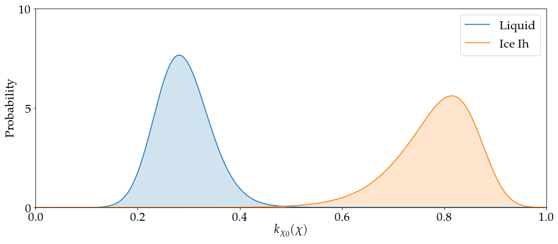

In this directory we provide Plumed inputs to calculate the distributions of the kernel in liquid water and in ice Ih.
The ```histoLiquid``` and ```histoSolid``` files can be created by running PLUMED with the commands:

```
plumed driver --mf_dcd ../IceIh/dump.dcd
plumed driver --mf_dcd ../Liquid/dump.dcd
```

Open the Jupyter notebook for more details.

The distributions are shown in the next figure.

